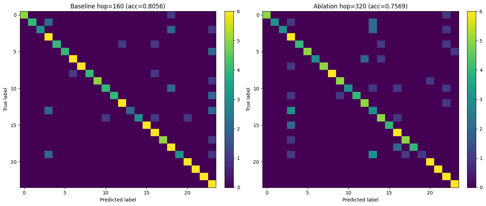
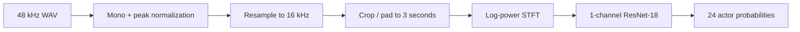
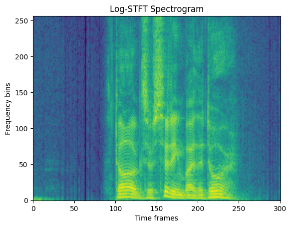

# STFT Speaker Identification

An end-to-end, closed-set speaker-identification system that converts speech
waveforms into log-STFT spectrograms and classifies one of 24 enrolled RAVDESS
actors with a ResNet-18 model.

[](https://www.python.org/)
[](https://pytorch.org/)
[](LICENSE)
[](https://zenodo.org/records/1188976)

> This is **speaker identification**, not speech-to-text: the model answers
> “which enrolled actor is speaking?” It does not transcribe speech or identify
> people outside its 24-class training set.

## Results

| Experiment | STFT hop | Best validation accuracy | Test accuracy |
|---|---:|---:|---:|
| Baseline | 160 samples (10 ms) | 79.38% | **80.56%** |
| Temporal-resolution ablation | 320 samples (20 ms) | 76.25% | 75.69% |

[Download the baseline checkpoint](https://github.com/yekev/stft-speaker-identification/releases/download/v1.0.0/ravdess-speaker-id-resnet18-hop160.pt)
or review its [Model Card](MODEL_CARD.md).

The baseline is **19.3× random-chance accuracy** for the 24-way task. Increasing
the hop from 10 ms to 20 ms reduces the number of temporal frames and lowers
test accuracy by 4.87 percentage points. Machine-readable metrics and full
classification reports are available in [`results/`](results/).



## System design



The baseline uses a 25 ms Hann window, a 10 ms hop, and a 512-point FFT. A
three-second clip becomes a `1 × 257 × 301` spectrogram.



## Reproduce the project

### 1. Create the environment

The recorded results were produced with Python 3.10 and the PyTorch 2.1.2 CPU
stack. The versions are fixed to avoid newer `torchaudio`/TorchCodec behavior
changing the audio pipeline.

```bash
conda env create -f environment.yml
conda activate speaker-id
pip install -e .
```

Alternatively:

```bash
python -m venv .venv
# Windows: .venv\Scripts\activate
# macOS/Linux: source .venv/bin/activate
python -m pip install --upgrade pip
pip install -r requirements.txt
pip install -e . --no-deps
```

### 2. Download RAVDESS

Review the RAVDESS license and download the audio-only speech subset from the
[official Zenodo record](https://zenodo.org/records/1188976). The helper below
downloads the same official archive only after explicit license acceptance:

```bash
python scripts/download_ravdess.py --accept-license
```

Expected layout:

```text
data/ravdess/
├── Actor_01/
├── ...
└── Actor_24/
```

The dataset is intentionally excluded from Git because it is large and has a
separate CC BY-NC-SA 4.0 license.

### 3. Prepare the split

A portable, deterministic seed-42 split is included. Regenerate it with:

```bash
speaker-id-prepare --dataset-root data/ravdess --output splits/split_seed42.json
```

This produces 1,152 training, 144 validation, and 144 test recordings, balanced
across all 24 speakers.

### 4. Train

```bash
speaker-id-train \
  --dataset-root data/ravdess \
  --split-file splits/split_seed42.json \
  --output-dir outputs/baseline \
  --model resnet18 \
  --hop-length 160 \
  --epochs 10
```

Use `--device cpu` when CUDA is unavailable. To reproduce the ablation, change
`--hop-length` to `320` and use a different output directory.

### 5. Evaluate

Download the published baseline checkpoint:

```bash
gh release download v1.0.0 \
  --repo yekev/stft-speaker-identification \
  --pattern "ravdess-speaker-id-resnet18-hop160.pt" \
  --dir checkpoints
```

```bash
speaker-id-evaluate \
  --dataset-root data/ravdess \
  --split-file splits/split_seed42.json \
  --checkpoint checkpoints/ravdess-speaker-id-resnet18-hop160.pt \
  --output-dir outputs/baseline-evaluation
```

The command writes JSON metrics, a text classification report, and a confusion
matrix. Checkpoints and generated outputs are excluded from Git to keep the
repository lightweight.

### 6. Run one prediction

```bash
speaker-id-predict data/ravdess/Actor_01/example.wav \
  --checkpoint checkpoints/ravdess-speaker-id-resnet18-hop160.pt \
  --top-k 3
```

The output contains the most likely RAVDESS actor IDs and probabilities. A
recording from an unknown person will still be forced into one of the 24 known
classes, so it must not be interpreted as real-world identity verification.

## Repository layout

```text
.
├── assets/                 # README figures
├── docs/                   # Experiment details and interpretation
├── results/                # Recomputed metrics and confusion matrices
├── scripts/                # Dataset download helper
├── splits/                 # Portable deterministic split manifest
├── src/speaker_id/         # Reusable data, model, training and inference code
├── tests/                  # Unit and smoke tests
├── MODEL_CARD.md            # Model scope, metrics, risks, and weight license
├── environment.yml         # Reproducible Conda environment
└── pyproject.toml          # Package and command-line entry points
```

## Scope and limitations

- The experiment is closed-set: every test speaker also appears in training.
- RAVDESS contains acted speech from only 24 professional actors and two fixed
  statements; performance should not be generalized to unconstrained speech.
- Splits are made per recording, not per speaker, because speaker identities
  must remain enrolled in a closed-set identification task.
- The model is a research/coursework prototype, not a biometric security
  system.

One held-out example, `Actor_01/03-01-03-01-02-02-01.wav`, was correctly
classified as `Actor_01` with probability 0.9692. The saved output is available
in [`docs/sample-inference.json`](docs/sample-inference.json).

## Coursework provenance

The ECE3001 assignment supplied a starter scaffold and defined the dataset and
task. The coursework contribution comprised experiment configuration and
execution, STFT parameter selection, the hop-length ablation, evaluation,
visualization, and analysis. This portfolio repository reorganizes that work
into a reusable command-line package and does not claim the supplied scaffold
as original work. See [Third-party notices](THIRD_PARTY_NOTICES.md).

## License and citation

The source code in this portfolio repository is available under the
[MIT License](LICENSE). RAVDESS is not included and remains under its own
CC BY-NC-SA 4.0 terms. The separately published model weights use the same
CC BY-NC-SA 4.0 license because they were trained on RAVDESS. If using the
project, cite:

> Livingstone, S. R., & Russo, F. A. (2018). The Ryerson Audio-Visual Database
> of Emotional Speech and Song (RAVDESS). *PLOS ONE, 13*(5), e0196391.
